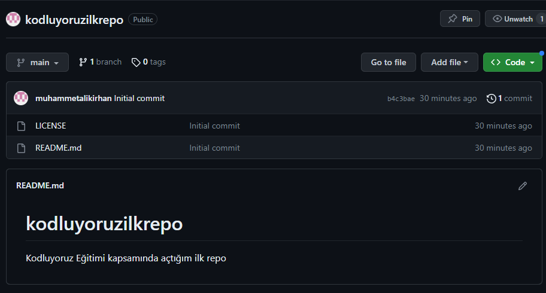

# Kodluyoruz Ilk Repo

Bu repo [Kodluyoruz](https://kodluyoruz.org/) Front-End Eğitminde oluşturduğumuz ilk repo. İçerisinde bir adet README dosyası, bir adet de index.html barındırıyor.



## Installation

Öncelikle projeyi clonelayın. (Buraya sizin reponuzdan aldığınız link gelecek)

`git clone https://github.com/muhammetalikirhan/kodluyoruzilkrepo.git`


## Usage

Projeyi cloneladıktan sonra Visual Studio Code promramında açınız.

Linux için;
``` 
cd kodluyoruzilkrepo
code . 
```

## Contributing

Pull requestler kabul edilir. Büyük değişiklikler için, lütfen önce neyi değiştirmek istediğinizi tartışmak için bir konu açınız.

## License

[MIT](https://choosealicense.com/licenses/mit/)